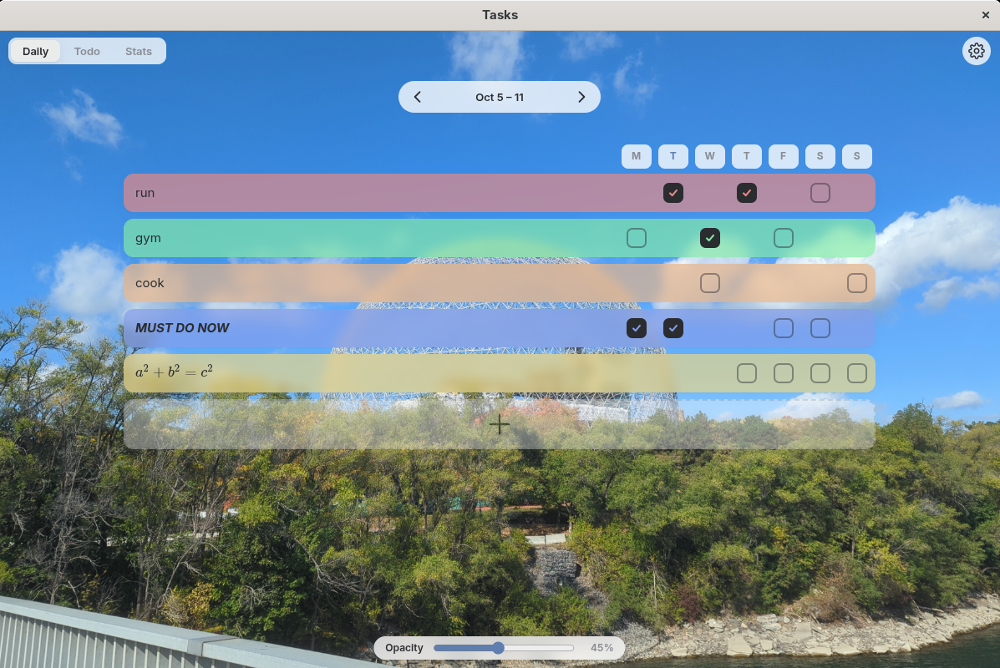

# todo app

Hybrid daily task tracker and todo list with statistics tracking.

Completely vibe coded to fill a niche I couldn't find elsewhere.

The default background is a photo of the Montreal Biodome I took in summer 2025.

## Why

Dedicated notes apps are too simplistic, and obsidian/notion have to be configured to work properly.

 This app aims to be a middle ground.

## Run

From the project root, run `npm install` once, then `npm start` to run it. 

Must have node installed.

## Use

Press plus to add tasks. It's pretty simple and intuitive.

All text supports ***markdown*** and $\LaTeX.$

Almost everything can be adjusted in the settings.